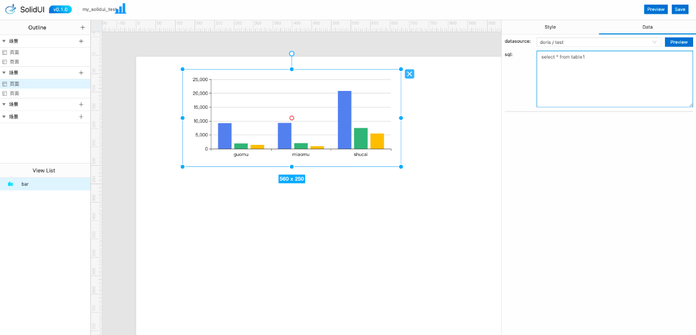

<h2 align="center">
  SolidUI
</h2>

  <strong>AI-generated visualization prototyping and editing platform</strong>

    
    

 

---

[English](README.md) | [中文](README_CN.md)

# Introduce

AI-generated visualization prototyping and editing platform, support 2D, 3D models, combined with LLM(Large Language Model) for quick editing.

## Core Features

* Minimalist process, concise design
* Various 2D legends
* Various 3D legends
* Various 3D scenes
* Support multiple data sources
* Support Huggingface space
* Support plug-in robot
* Support SolidUI-Model
* Support Large Language Model
* Containerized deployment

# QuickStart

For quick experience

Want to start with [Standalone](https://website.solidui.top/docs/deployment/deployment-standalone)

Want to start with [Docker](https://website.solidui.top/docs/deployment/deployment-docker)

# What's this?

With the rise of language models for generating images from text, SolidUI wants to help people quickly build visualization tools. The visualization content includes 2D, 3D, and 3D scenes, so as to quickly construct 3D data presentation scenes. SolidUI is an innovative project that aims to combine natural language processing (NLP) with computer graphics to realize the function of Vincent diagram. By building a self-developed Wensheng graph language model, SolidUI uses the RLHF (Reinforcement Learning Human Feedback) process to realize the process from text description to graph generation.

## Self-developed Wensheng graph language model

SolidUI's Vincent graph language model is a deep learning model that can convert natural language descriptions input by users into specific graphical representations. This model is trained on a large amount of text and graphics data, and learns the mapping relationship from text to graphics. To achieve this goal, SolidUI's self-developed Vincent graph language model has the following characteristics:

* Combining NLP and computer graphics to realize the process from text description to graphic generation
* Can handle various types of graphics, such as 2D, 3D and scenes, etc.
* The model training process involves a large amount of text and graphics data to ensure the quality and accuracy of the generated graphics

## RLHF process

SolidUI uses the RLHF (Reinforcement Learning Human Feedback) process to optimize the performance of the Vincent graph language model. The process leverages human feedback to guide the model's learning process, enabling the model to better meet user needs. The main steps of the RLHF process include:

* Collect Feedback: Users rate the generated graphs, providing feedback on the quality and accuracy of the graphs.
* Updating the model: Based on the feedback collected, the model is updated using reinforcement learning algorithms to improve the quality and accuracy of the generated graphics.
* Iterative optimization: The process of collecting feedback and updating the model is repeated until the model performance reaches a satisfactory level.

Through this process, SolidUI's Vincent graph language model is able to continuously learn and improve from user feedback, producing graphics of higher quality and accuracy.

# Document

For a complete list of documentation for SolidUI, see [SolidUI-Website](https://website.solidui.top)

# Contribute

We welcome and look forward to more contributors participating in building SolidUI, whether it is code, documentation, or other forms of contribution that can help the community.

# Contact US

- For any questions and suggestions about SolidUI, you can submit an issue for tracking, processing and experience sharing
- [twitter](https://twitter.com/dlimeng192048)
- [youtube](https://www.youtube.com/@dlimeng)
- [bilibili](https://space.bilibili.com/472576729) (in Chinese)
- [slack](https://join.slack.com/t/solidui/shared_invite/zt-1r83iino0-SZD38aHAIw2KBA~DSpZndA)
- You can scan the QR code below and join our WeChat group for faster response (in Chinese)

- WeChat Official Account (in Chinese)

# Who is using SolidUI

We created an issue [[Who is Using SolidUI]](https://github.com/CloudOrc/SolidUI/issues/1) for user feedback and documentation of who is using SolidUI.

# Contributors

Thanks to everyone who contributed PR~ 🎉🎉🎉

# Thanks And Support

We are very grateful for your support and recognition of our project and development work. In open source software development, we deeply know that user and community feedback and support are crucial. Our project has provided a README and Issue system to facilitate user deployment and problem solving, while also helping to increase project activity. We will prioritize issues raised in the issues.

If you are interested in the community, welcome to participate (code, documentation, use), welcome to participate in any form.

If you feel that the SolidUI project is valuable to you and are willing to support our development work, please give the project a little star or [sponsor us](https://afdian.net/a/solidui).

